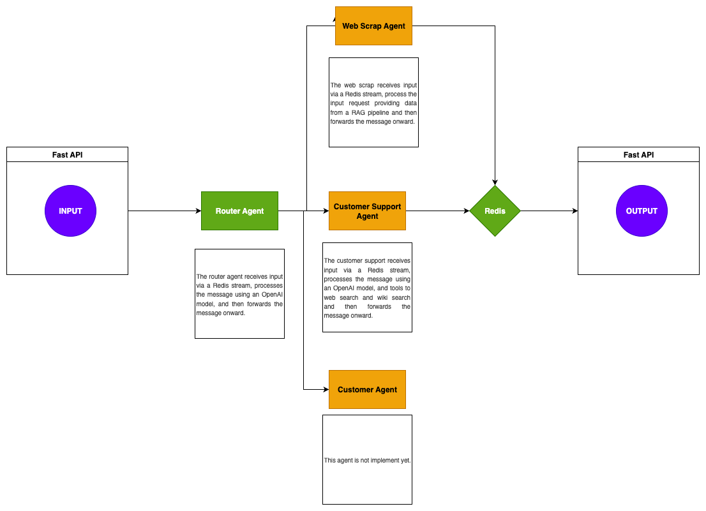

# Multi Agent Project with LangChan and OpenAI API

## Overview

This is an AI engineering project developed as a template for real world applications. It combines software engineering skills, AI engineering knowledge, powerful frameworks, and delivers a meaningful AI project that is simple and efficient.

## Index

1. [Table of Contents](#table-of-contents)
2. [Architecture](#architecture)
3. [Local Setup](#local-setup)
4. [Testing](#testing)
5. [Notes](#notes)

## Table of Contents

The project is a multi-agent system combining AI with software engineering to deliver an application capable of connecting with different applications through a FastAPI endpoint. It analyzes the input and routes it between different solution agents. The release version includes three agents: the first one classifies and routes the input, while another agent combines web scraping, customer support, Wikipedia, and web search. All input and output are handled via the API endpoint.

## Architecture

Technologies:
- LangChain
- OpenAI API
- FastAPI
- Python
- Redis
- Docker




## Local Setup

Steps to configure the environment locally:

1. Clone this repository
   ```bash
   git clone https://github.com/FabricioDE/multi-agent-fastapi-redis.git

2. Insert the OpenAI API key into the configuration file located in the `utils` folder.

3. Run the following command to build and start the services:

   ```bash
   docker-compose up --build

4. Access the FastAPI Swagger documentation at:

   [http://localhost:8000/docs](http://localhost:8000/docs)

5. Test the POST endpoint with the following example message:

   ```json
   {
     "message": "Previsão do tempo em São Paulo",
     "user_id": "a123"
   }


## Testing

The testing approach was designed with the importance of real-time communication between agents using Redis streams in mind, as well as endpoint availability. There is still room to apply more comprehensive testing on class methods.

To perform tests on each container, follow these steps:

1. Run the command to list all running containers:

   ```bash
   docker ps

(Take note of the container ID for each service you want to test.)

2. For each container, execute the following command to access its shell:

    docker exec -it <container_id> /bin/bash

3. Once inside the container, navigate to the tests directory:

    cd tests

4. Run the appropriate test command for each container:

    - API Container:
    PYTHONPATH=.. python -m unittest test_api.py

    - Agent Router Container:
    PYTHONPATH=.. python -m unittest test_agent_router.py

    - Agent Knowledge Container:
    PYTHONPATH=.. python -m unittest test_agent_knowledge.py

    - Agent Support Container:
    PYTHONPATH=.. python -m unittest test_agent_support.py

## Notes

The idea of this project is to create a foundation for real-world applications by structuring streaming communication between different containers, multi-agent solutions, and communication APIs. The project uses two LangChain tools: one for web search and another for Wikipedia search.